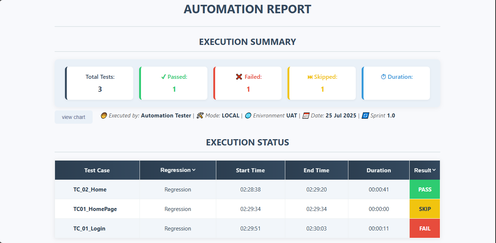
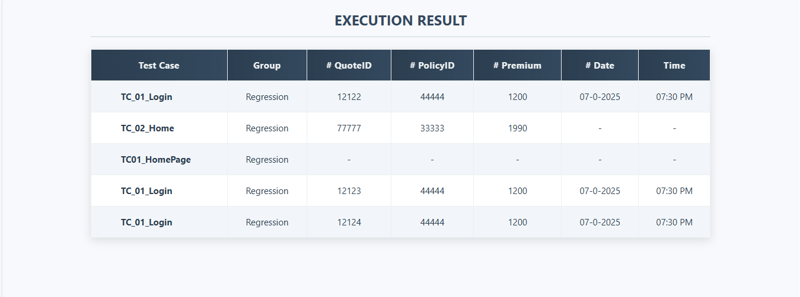
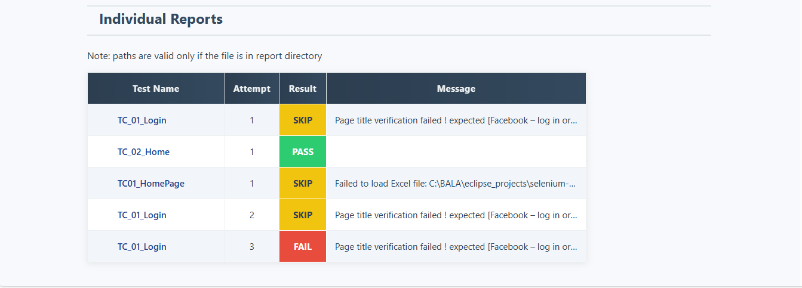

# 📊 Summary Report - Documentation

## 🧠 Overview
The summary report consolidates the overall test execution results, offering a quick visual digest of:

- ✅ Total number of tests

- 🟩 Count of passed, failed, skipped outcomes

- ⏱️ Full execution duration across all tests

- 👤 Execution context (who, how, when)

- 📋 Indivdual test execution status

- 📑 Outcome data(domain specific) from the execution

- 🔗 Report Links (Per Attempt)

It’s rendered into a styled `report.html` using a template system and populated with runtime data tracked by `HtmlBuilder`.

## 🧩 Key Components

### `statusRows` - EXECUTION STATUS 
- Tracks final test execution result per test method.

- Latest test entry for retried tests. retried tests are removed and counted via `retriedTestCases`

### `resultRows` - EXECUTION RESULT
Stores domain-specific test data (quote ID, policy ID, premium, etc.).

### `reportLinks` - Individual Reports
Stores links to individual test run reports(including retried testcase reports)

Each entry includes: testName, attemptNumber, filePath, result, message.

## Usage
* create a global `HtmlBuilder` object.
* call respective methods to add data.
* call the `generate()` method at `tearDown`

## Sample Report

[Go to Description](#-summary-report---documentation)

